# Verifizierungs-Flow (Technische Perspektive)

> Was die Geräte und das System tun

## Datenmodell


## QR-Code Struktur


**Minimal (druckfreundlich):**
```json
{
  "did": "did:wot:a7f382b1c9d4e5f6",
  "pk": "ed25519:base64encodedkey..."
}
```

**Erweitert (digitaler QR):**
```json
{
  "did": "did:wot:a7f382b1c9d4e5f6",
  "pk": "ed25519:base64encodedkey...",
  "name": "Anna Müller",
  "sig": "signatur_des_payloads"
}
```

## Hauptflow: Gegenseitige Verifizierung

```mermaid
sequenceDiagram
    participant A_UI as Anna's UI
    participant A_App as Anna's App
    participant Sync as Sync Server
    participant B_App as Ben's App
    participant B_UI as Ben's UI

    Note over A_UI,B_UI: Phase 1: Ben verifiziert Anna

    A_UI->>A_App: showQRCode()
    A_App->>A_App: generateQR(did, publicKey)
    A_App->>A_UI: Display QR
    
    B_UI->>B_App: scanQR()
    B_App->>B_App: parseQR() → {did, publicKey}
    
    alt Online
        B_App->>Sync: fetchProfile(did)
        Sync->>B_App: {name, photo, bio, signature}
        B_App->>B_App: verifySignature(profile, publicKey)
        B_App->>B_UI: Zeige Profil
    else Offline
        B_App->>B_App: computeIDHash(did)
        B_App->>B_UI: Zeige ID-Prüfwert
    end
    
    B_UI->>B_App: confirmIdentity()
    
    alt Ben hat noch keine ID
        B_App->>B_App: generateKeyPair()
        B_App->>B_App: createDID()
        B_App->>B_App: savePrivateKey(secure)
    end
    
    B_App->>B_App: createVerification(anna.did)
    Note over B_App: {from: ben.did, to: anna.did,<br/>timestamp, signature}
    B_App->>B_App: saveContact(anna, "pending")
    
    Note over A_UI,B_UI: Phase 2: Anna verifiziert Ben

    B_UI->>B_App: showQRCode()
    B_App->>B_UI: Display QR
    
    A_UI->>A_App: scanQR()
    A_App->>A_App: parseQR() → {did, publicKey}
    A_App->>A_UI: Zeige Profil (+ "X Kontakte kennen Ben")
    
    A_UI->>A_App: confirmIdentity()
    A_App->>A_App: createVerification(ben.did)
    A_App->>A_App: saveContact(ben, "active")
    A_App->>A_App: addToAutoGroup(ben)
    A_App->>A_App: reencryptItemsForNewContact(ben)
    
    Note over A_UI,B_UI: Phase 3: Sync & Finalisierung

    A_App->>Sync: pushVerification()
    A_App->>Sync: pushReencryptedItemKeys()
    Sync->>B_App: pullUpdates()
    B_App->>B_App: updateContact(anna, "active")
    B_App->>B_App: addToAutoGroup(anna)
    B_App->>B_App: reencryptItemsForNewContact(anna)
    B_App->>Sync: pushReencryptedItemKeys()
```



## Detailflow: Verifizierung erstellen

```mermaid
flowchart TD
    Start([Nutzer tippt<br/>"Identität bestätigen"]) --> CheckID{Eigene ID<br/>vorhanden?}
    
    CheckID -->|Nein| GenKey[generateKeyPair]
    GenKey --> GenDID[createDID]
    GenDID --> SaveKey[savePrivateKey<br/>to secure storage]
    SaveKey --> ShowRecovery[Zeige Recovery-Phrase<br/>KRITISCH: Nutzer muss sichern!]
    ShowRecovery --> CreateVerif
    
    CheckID -->|Ja| CreateVerif[createVerification]
    
    CreateVerif --> BuildPayload["payload = {<br/>  type: 'verification',<br/>  from: own.did,<br/>  to: contact.did,<br/>  timestamp: now(),<br/>}"]
    
    BuildPayload --> Sign["signature = sign(<br/>  payload,<br/>  own.privateKey<br/>)"]
    
    Sign --> Store["Speichere lokal:<br/>- Contact + publicKey<br/>- Verification-Dokument"]
    
    Store --> CheckMutual{Gegenseitige<br/>Verifizierung<br/>vorhanden?}
    
    CheckMutual -->|Ja| Activate[Status → "active"]
    Activate --> AddGroup[Zu Auto-Gruppe<br/>hinzufügen]
    AddGroup --> Reencrypt[Item Keys neu<br/>verschlüsseln]
    Reencrypt --> Queue[In Sync-Queue]
    
    CheckMutual -->|Nein| Pending[Status → "pending"]
    Pending --> Queue
    
    Queue --> End([Fertig])
```

## Detailflow: Item Keys neu verschlüsseln

```mermaid
flowchart TD
    Start([Neuer Kontakt<br/>in Auto-Gruppe]) --> Fetch[Lade alle Items mit<br/>target: "allContacts"]
    
    Fetch --> Loop{Für jedes Item}
    
    Loop --> Decrypt[Entschlüssele Item Key<br/>mit eigenem Private Key]
    Decrypt --> Encrypt[Verschlüssele Item Key<br/>mit neuem Contact's Public Key]
    Encrypt --> Store[Speichere verschlüsselten<br/>Item Key für Contact]
    Store --> Loop
    
    Loop -->|Alle fertig| Queue[Alle neuen Item Keys<br/>in Sync-Queue]
    Queue --> End([Fertig])
```

## Detailflow: Offline-Verifizierung

```mermaid
sequenceDiagram
    participant A as Anna's Gerät
    participant B as Ben's Gerät
    
    Note over A,B: Kein Internet verfügbar
    
    A->>A: generateQR(did, publicKey)
    A->>B: [QR-Scan physisch]
    
    B->>B: parseQR()
    B->>B: computeIDHash(did)
    B->>B: display("a7f3-82b1-...")
    
    Note over A,B: 🗣️ Mündlicher Abgleich
    A->>A: display own ID hash
    A->>B: "Bei mir steht a7f3-82b1"
    B->>B: verify match ✓
    
    B->>B: createVerification(anna.did)
    B->>B: saveContact(anna, "pending")
    Note over B: Lokal gespeichert,<br/>wartet auf Sync
    
    Note over A,B: [Rollen tauschen]
    
    B->>B: generateQR(did, publicKey)
    B->>A: [QR-Scan physisch]
    A->>A: parseQR()
    A->>A: computeIDHash(did)
    
    Note over A,B: 🗣️ Mündlicher Abgleich
    A->>A: verify match ✓
    
    A->>A: createVerification(ben.did)
    A->>A: saveContact(ben, "active")
    A->>A: addToAutoGroup(ben)
    A->>A: reencryptItemsForNewContact(ben)
    Note over A: Alles lokal,<br/>wartet auf Sync
    
    Note over A,B: ⏳ Später: Beide online
    
    A->>A: syncPush()
    B->>B: syncPush()
    B->>B: syncPull()
    B->>B: updateContact(anna, "active")
    B->>B: addToAutoGroup(anna)
```



## Zustandsdiagramm: Kontakt-Status

```mermaid
stateDiagram-v2
    [*] --> Pending: Einseitig verifiziert
    
    Pending --> Active: Gegenseite verifiziert zurück
    Pending --> [*]: Timeout / Abbruch
    
    Active --> Hidden: Nutzer blendet aus
    
    Hidden --> Active: Nutzer macht rückgängig
    
    state Active {
        [*] --> InAutoGroup
        InAutoGroup: In Auto-Gruppe<br/>Sieht neuen Content<br/>Erhält Item Keys
    }
    
    state Hidden {
        [*] --> OutOfAutoGroup
        OutOfAutoGroup: Aus Auto-Gruppe<br/>Sieht keinen neuen Content<br/>Alte Items noch lesbar
    }
    
    state Pending {
        [*] --> WaitingForMutual
        WaitingForMutual: Warte auf gegenseitige<br/>Verifizierung
    }
```



## Datenstrukturen

### Verification Document

```json
{
  "@context": "https://w3id.org/weboftrust/v1",
  "type": "IdentityVerification",
  "id": "urn:uuid:123e4567-e89b-12d3-a456-426614174000",
  "from": "did:wot:anna123",
  "to": "did:wot:ben456",
  "timestamp": "2025-01-08T14:30:00Z",
  "proof": {
    "type": "Ed25519Signature2020",
    "verificationMethod": "did:wot:anna123#key-1",
    "proofValue": "z58DAdFfa9SkqZMVPxAQpic7ndTEcnUn..."
  }
}
```

### Contact Record (lokal)

```json
{
  "did": "did:wot:ben456",
  "publicKey": "ed25519:base64...",
  "name": "Ben Schmidt",
  "status": "active",
  "verifiedAt": "2025-01-08T14:30:00Z",
  "myVerification": "urn:uuid:123e4567-...",
  "theirVerification": "urn:uuid:789abcde-..."
}
```

### Auto-Group (lokal)

```json
{
  "id": "urn:uuid:autogrup-anna",
  "type": "AutoContactGroup",
  "groupKey": "aes256:encrypted_with_own_pubkey...",
  "members": [
    "did:wot:ben456",
    "did:wot:carla789"
  ],
  "lastKeyRotation": "2025-01-08T14:30:00Z"
}
```
