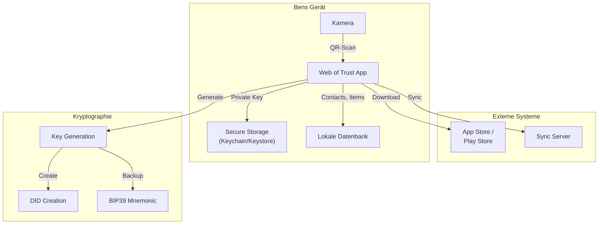
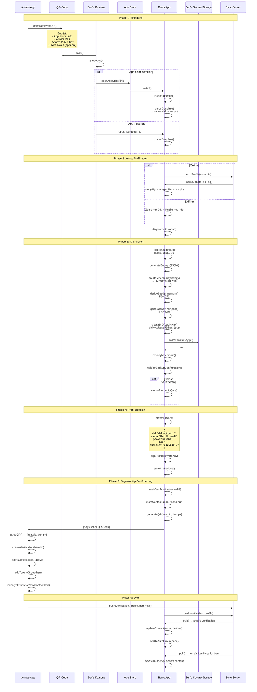
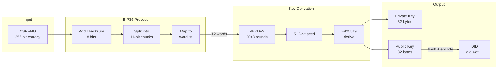
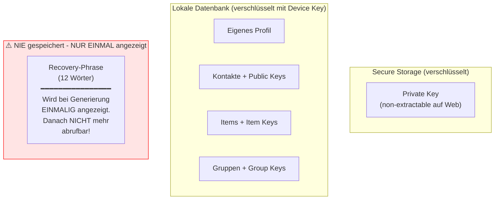
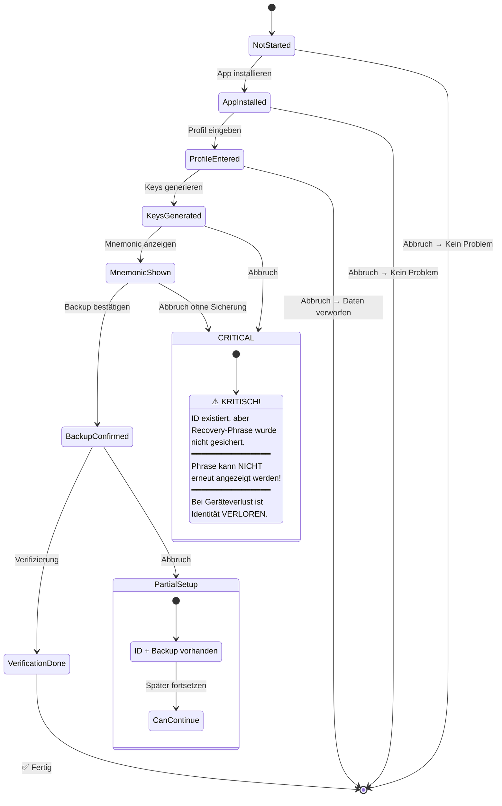
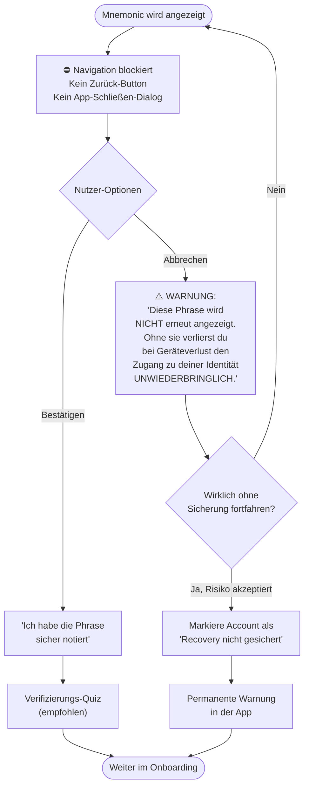

# Onboarding-Flow (Technische Perspektive)

> Wie eine neue Identität erstellt und ins Netzwerk integriert wird

## Übersicht: Onboarding-Architektur



## Detailflow: ID-Erstellung

```mermaid
flowchart TD
    Start([Nutzer tippt<br/>"ID erstellen"]) --> Entropy[Sammle Entropie<br/>CSPRNG]
    
    Entropy --> GenMnemonic[Generiere BIP39<br/>Mnemonic<br/>12 Wörter]
    
    GenMnemonic --> DeriveSeed[Derive Seed<br/>von Mnemonic<br/>PBKDF2]
    
    DeriveSeed --> GenKeyPair[Generiere<br/>Ed25519 KeyPair<br/>von Seed]
    
    GenKeyPair --> CreateDID[Erstelle DID<br/>did:wot:hash]
    
    CreateDID --> StorePrivate[Speichere Private Key<br/>in Secure Storage]
    
    StorePrivate --> BlockNav["⛔ Blockiere Navigation<br/>(kein Zurück, kein Schließen)"]
    
    BlockNav --> ShowMnemonic["🔐 Zeige Mnemonic<br/>━━━━━━━━━━━━━━━━<br/>⚠️ EINMALIGE ANZEIGE<br/>Phrase wird NICHT<br/>gespeichert!"]
    
    ShowMnemonic --> UserChoice{Nutzer-Aktion}
    
    UserChoice -->|Bestätigt Sicherung| VerifyQuiz[Verifizierungs-Quiz<br/>3 Wörter abfragen]
    VerifyQuiz -->|Korrekt| MarkSecured[Markiere als<br/>"gesichert" ✅]
    VerifyQuiz -->|Falsch| ShowMnemonic
    
    UserChoice -->|Will ohne Sicherung<br/>fortfahren| ShowWarning["⚠️ KRITISCHE WARNUNG<br/>'Phrase wird NICHT erneut<br/>angezeigt. Bei Geräteverlust<br/>ist Identität VERLOREN.'"]
    
    ShowWarning --> Confirm{Risiko akzeptieren?}
    Confirm -->|Nein| ShowMnemonic
    Confirm -->|Ja| MarkUnsecured["Markiere als<br/>'NICHT gesichert' ⚠️<br/>→ Permanente Warnung"]
    
    MarkSecured --> CreateProfile[Erstelle lokales<br/>Profil-Dokument]
    MarkUnsecured --> CreateProfile
    
    CreateProfile --> SignProfile[Signiere Profil<br/>mit Private Key]
    
    SignProfile --> Ready([ID bereit])
    
    style ShowMnemonic fill:#FFF3CD,stroke:#FFD700
    style ShowWarning fill:#FFE4E4,stroke:#FF0000
    style MarkUnsecured fill:#FFE4E4,stroke:#FF0000
```

## Sequenzdiagramm: Vollständiges Onboarding



## Kryptographische Details

### Key Generation



### DID Structure

```
did:wot:7Hy3kPqR9mNx2Wb5vLz8
     │   └──────────────────── Base58 encoded
     │                         first 16 bytes of
     │                         SHA256(publicKey)
     └────────────────────────── Method name
```

### Profil-Signatur

```json
{
  "@context": "https://w3id.org/weboftrust/v1",
  "type": "Profile",
  "id": "did:wot:7Hy3kPqR9mNx2Wb5vLz8",
  "name": "Ben Schmidt",
  "photo": "ipfs://Qm...",
  "bio": "Neu in der Gegend",
  "publicKey": {
    "type": "Ed25519VerificationKey2020",
    "publicKeyMultibase": "z6Mkf..."
  },
  "updated": "2025-01-08T14:30:00Z",
  "proof": {
    "type": "Ed25519Signature2020",
    "verificationMethod": "did:wot:7Hy3kPqR9mNx2Wb5vLz8#key-1",
    "proofPurpose": "assertionMethod",
    "proofValue": "z58DAdFfa9..."
  }
}
```

## Invite-QR vs. Standard-QR

### Standard-QR (für bestehende Nutzer)

```json
{
  "type": "wot-identity",
  "did": "did:wot:anna123",
  "pk": "ed25519:base64..."
}
```

### Invite-QR (für Onboarding)

```json
{
  "type": "wot-invite",
  "app": "https://weboftrust.app/download",
  "did": "did:wot:anna123",
  "pk": "ed25519:base64...",
  "token": "optional-invite-token"
}
```

Das `token` könnte für Analytics oder spezielle Invite-Flows genutzt werden (z.B. "Einladung von Kemal beim Straßenfest").

## Secure Storage

### Platform-spezifisch

| Platform | Storage | Details |
|----------|---------|---------|
| iOS | Keychain | `kSecClassKey`, Hardware-backed wenn verfügbar |
| Android | Keystore | `AndroidKeyStore`, TEE/Strongbox wenn verfügbar |
| Web | Web Crypto API + IndexedDB | `extractable: false`, Key nie als Raw exportierbar |

### Web Crypto API Details

```javascript
// Non-extractable Key generieren
const keyPair = await crypto.subtle.generateKey(
  { name: "Ed25519" },
  false,  // extractable = false → Key kann nie exportiert werden
  ["sign", "verify"]
);

// In IndexedDB speichern (CryptoKey-Objekt direkt)
const db = await openDB('wot-keys', 1);
await db.put('keys', keyPair.privateKey, 'privateKey');
await db.put('keys', keyPair.publicKey, 'publicKey');

// Key kann nur für sign/verify verwendet werden
const signature = await crypto.subtle.sign(
  { name: "Ed25519" },
  keyPair.privateKey,
  data
);
```

### Web-spezifische Risiken

| Risiko | Mitigation |
|--------|------------|
| "Browserdaten löschen" löscht Keys | ⚠️ Recovery-Phrase ist EINZIGER Weg zurück |
| Kein Cross-Device Sync | Nutzer muss auf jedem Gerät recovern |
| Browser-Update könnte brechen | Unwahrscheinlich, aber Monitoring nötig |

→ **Konsequenz:** Recovery-Phrase-Sicherung ist im Web noch kritischer als bei nativen Apps!

### Was wird gespeichert



**KRITISCH:** Die Recovery-Phrase wird aus Sicherheitsgründen nirgendwo gespeichert. Sie wird dem Nutzer **exakt einmal** bei der ID-Erstellung angezeigt. Danach gibt es keine Möglichkeit, sie erneut anzuzeigen. Wenn der Nutzer sie nicht sichert und später den Zugang zum Gerät verliert, ist die Identität **unwiederbringlich verloren**.

## Fehlerbehandlung

### Onboarding-Abbruch



### Abbruch während Mnemonic-Anzeige verhindern



### Permanente Warnung bei ungesicherter Phrase

Da die Phrase nicht erneut angezeigt werden kann, zeigt die App eine **permanente, nicht schließbare Warnung** wenn der Nutzer ohne Sicherung fortfährt:

```
┌─────────────────────────────────────────┐
│ ⚠️ WARNUNG: Recovery nicht gesichert    │
│                                         │
│ Deine Recovery-Phrase wurde nicht       │
│ gesichert. Bei Verlust dieses Geräts    │
│ oder Löschung der App-Daten ist deine   │
│ Identität UNWIEDERBRINGLICH verloren.   │
│                                         │
│ Diese Warnung kann nicht geschlossen    │
│ werden.                                 │
│                                         │
│ Einzige Lösung: Neue ID erstellen und   │
│ von allen Kontakten neu verifizieren    │
│ lassen.                                 │
└─────────────────────────────────────────┘
```

## Datenstrukturen

### Lokaler Onboarding-State

```json
{
  "onboardingState": {
    "step": "mnemonic_shown",
    "startedAt": "2025-01-08T14:00:00Z",
    "invitedBy": "did:wot:anna123",
    "profileDraft": {
      "name": "Ben Schmidt",
      "photo": null,
      "bio": ""
    },
    "keysGenerated": true,
    "mnemonicBackedUp": false,
    "reminderCount": 0
  }
}
```

### Nach Abschluss: User Record

```json
{
  "user": {
    "did": "did:wot:ben456",
    "name": "Ben Schmidt",
    "photo": "ipfs://Qm...",
    "bio": "Neu in der Gegend",
    "publicKey": "ed25519:base64...",
    "createdAt": "2025-01-08T14:30:00Z",
    "onboardedBy": "did:wot:anna123",
    "mnemonicBackedUp": true,
    "mnemonicBackedUpAt": "2025-01-08T14:35:00Z"
  }
}
```

## Sicherheitsüberlegungen

### Threat Model

| Threat | Mitigation |
|--------|------------|
| Mnemonic abfotografiert | Warnung "Kein Screenshot" + OS-Screenshot-Schutz |
| Shoulder Surfing | Privater Raum empfohlen, Wörter können einzeln angezeigt werden |
| Malware auf Gerät | Secure Storage / Web Crypto nutzt Hardware-Isolation |
| Server-Kompromittierung | Private Key verlässt nie das Gerät |
| QR-Code-Fälschung | Profil ist signiert, Fälschung erkennbar |
| Browser-Daten gelöscht (Web) | Recovery über Mnemonic - **einziger Weg!** |

### Best Practices

1. **Mnemonic NUR EINMAL anzeigen** - Wird nirgendwo gespeichert, kann nicht erneut abgerufen werden
2. **Abbruch während Mnemonic-Anzeige verhindern** - Navigation blockieren bis bestätigt oder bewusst abgelehnt
3. **Kein Cloud-Backup des Keys** - Nur Mnemonic auf Papier
4. **Biometrie optional** - Für App-Entsperrung, nicht für Key-Zugriff
5. **Permanente Warnung** - Wenn Nutzer ohne Sicherung fortfährt, dauerhafte UI-Warnung

### Recovery-Szenario

```mermaid
flowchart TD
    Loss([Gerät verloren /<br/>Daten gelöscht]) --> HasPhrase{Recovery-Phrase<br/>gesichert?}
    
    HasPhrase -->|Ja| Recover[Neue App installieren<br/>→ "Wiederherstellen"<br/>→ 12 Wörter eingeben]
    Recover --> Restored[✅ Identität wiederhergestellt<br/>Alle Kontakte noch da<br/>Alle Attestationen noch da]
    
    HasPhrase -->|Nein| Lost[❌ Identität VERLOREN]
    Lost --> NewID[Einzige Option:<br/>Neue ID erstellen]
    NewID --> Reverify[Alle Kontakte müssen<br/>neu verifizieren]
    NewID --> LostAttestations[Alte Attestationen<br/>unwiederbringlich verloren]
    
    style Lost fill:#FF6B6B
    style LostAttestations fill:#FF6B6B
```
