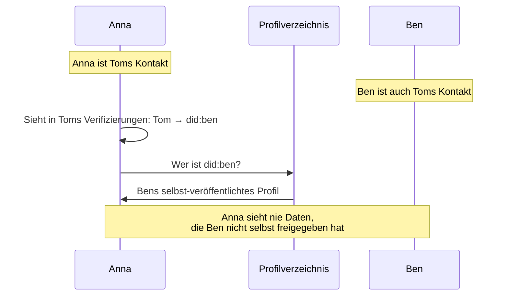

# Graph und Sichtbarkeit

> Wie das Netzwerk aus lokalen Perspektiven entsteht

## Grundprinzip

Das Web of Trust ist ein dezentraler Graph. Es gibt keinen zentralen Server, der "den Graphen" kennt. Stattdessen:

- Jeder Teilnehmer hat seinen **eigenen lokalen Graph**
- Dieser Graph enthält nur das, was durch Vertrauen zu ihm geflossen ist
- Der "Gesamtgraph" existiert implizit als Summe aller lokalen Graphen
- Niemand sieht oder berechnet den Gesamtgraph

```
┌─────────────────────────────────────────────────────────────┐
│                                                             │
│  Der Gesamtgraph existiert - aber niemand sieht ihn.        │
│                                                             │
│  Was ich sehe: Mein lokaler Ausschnitt.                     │
│  Je mehr Verbindungen ich habe, desto größer mein Graph.    │
│                                                             │
└─────────────────────────────────────────────────────────────┘
```

---

## Datenhoheit

### Ich teile nur meine eigenen Daten

Ein fundamentales Prinzip: **Keine Weitergabe von Daten anderer Menschen.**

Alle meine Daten werden E2E-verschlüsselt mit meiner **Auto-Gruppe** geteilt (alle verifizierten Kontakte, die ich nicht ausgeblendet habe).

| Was ich teile | Was ich NICHT teile |
|---------------|---------------------|
| Mein Profil | Profile anderer |
| Meine Termine, Orte, Angebote/Nachfragen | Content anderer |
| Empfangene Verifizierungen (andere → ich) | Verifizierungen zwischen Dritten |
| Empfangene Attestationen (andere → ich) | Attestationen zwischen Dritten |

### Empfänger-Prinzip

Verifizierungen und Attestationen werden beim **Empfänger** gespeichert:

- Anna verifiziert Ben → wird bei **Ben** gespeichert
- Ben attestiert Anna → wird bei **Anna** gespeichert

**Konsequenz:** Mein Profil zeigt, wer **mich** verifiziert hat und was **über mich** gesagt wurde. Nicht, wen ich verifiziert habe.

```
┌─────────────────────────────────────────────────────────────┐
│                                                             │
│  Bens öffentliches Profil zeigt:                            │
│                                                             │
│  Verifiziert von: Anna, Carla, Tom                          │
│  Attestationen:   "Hat im Garten geholfen" (von Anna)       │
│                   "Zuverlässig" (von Carla)                 │
│                                                             │
│  Ben kontrolliert, was sichtbar ist (hidden-Flag).          │
│                                                             │
└─────────────────────────────────────────────────────────────┘
```

**Wichtig:** Es gibt keine separate "Kontaktliste". Meine Kontakte sind ableitbar aus den empfangenen Verifizierungen. Der Sender speichert nur den **Public Key** für die E2E-Verschlüsselung.

### Profile sind selbst-veröffentlicht

Wenn ich wissen will, wer `did:key:z6Mk...` ist:

1. Ich habe die DID (aus den Verifizierungen eines Kontakts)
2. Ich frage das **öffentliche Profil** ab
3. Die Person selbst hat ihr Profil veröffentlicht
4. Ich sehe nur, was sie freigegeben hat



---

## Der lokale Graph

### Knoten

Jeder Knoten ist eine Identität, repräsentiert durch eine DID.

| Knoten-Typ | Beschreibung |
|------------|--------------|
| Eigene Identität | Meine DID, mein Profil |
| Direkter Kontakt | DID eines Menschen, den ich verifiziert habe |
| Indirekter Kontakt | DID aus den Verifizierungen eines meiner Kontakte |

### Kanten

| Kanten-Typ | Richtung | Bedeutung |
|------------|----------|-----------|
| Verifizierung | A → B | "A hat B getroffen und verifiziert" |
| Attestation | A → B | "A sagt etwas über B" |

Verifizierungen werden erst "aktiv", wenn beide Richtungen existieren (gegenseitige Verifizierung).

### Was ich sehe

```
Mein lokaler Graph
│
├── Meine Identität
│   └── Meine empfangenen Verifizierungen: [Anna→Ich, Ben→Ich, Tom→Ich]
│
├── Meine direkten Kontakte (gegenseitig verifiziert)
│   ├── Anna
│   │   └── Annas empfangene Verifizierungen: [Carla→Anna, David→Anna, ...]
│   ├── Ben
│   │   └── Bens empfangene Verifizierungen: [Carla→Ben, Eva→Ben, ...]
│   └── Tom
│       └── Toms empfangene Verifizierungen: [Eva→Tom, Frank→Tom, ...]
│
└── Indirekte Kontakte (DIDs aus Verifizierungen meiner Kontakte)
    ├── did:carla (hat Anna und Ben verifiziert)
    ├── did:david (hat Anna verifiziert)
    ├── did:eva (hat Ben und Tom verifiziert)
    └── did:frank (hat Tom verifiziert)
```

**Hinweis:** Ich sehe die empfangenen Verifizierungen meiner Kontakte. Daraus kann ich ableiten:

- Wer sie verifiziert hat (direkt sichtbar im Profil)
- Wen sie verifiziert haben (indirekt: diese Info liegt beim jeweiligen Empfänger)

Beispiel: Ich kenne Anna und Ben. Ich sehe in Carlas Profil: `Anna → Carla` und `Ben → Carla`. Das heißt: "2 meiner Kontakte haben Carla verifiziert."

---

## Vertrauen vs. Sichtbarkeit

### Vertrauen ist direkt

Ich vertraue nur Menschen, die ich **selbst** getroffen und verifiziert habe. Es gibt kein transitives Vertrauen ("Freund eines Freundes").

### Sichtbarkeit ist geteilt

Meine Kontakte teilen ihre Verifizierungen mit mir. So sehe ich, wen sie verifiziert haben - ohne diesen Menschen selbst zu vertrauen.

```
┌─────────────────────────────────────────────────────────────┐
│                                                             │
│  Vertrauen ≠ Sichtbarkeit                                   │
│                                                             │
│  Vertrauen:    Ich → Anna ✓                                 │
│                Ich → Carla ✗ (nicht getroffen)              │
│                                                             │
│  Sichtbarkeit: Ich sehe Annas Verifizierung: Anna → Carla   │
│                Ich kann Carlas öffentliches Profil sehen.   │
│                Aber ich vertraue Carla nicht.               │
│                                                             │
└─────────────────────────────────────────────────────────────┘
```

---

## Anwendungsfälle

### "Gemeinsame Kontakte"

Wenn ich eine neue Person treffe (z.B. Carla), kann meine App zeigen:

> "2 gemeinsame Kontakte: Anna, Ben"

**Berechnung:**
```
Meine Kontakte ∩ Carlas Kontakte = [Anna, Ben]
```

Das ist Information, nicht Vertrauen. Vertrauen entsteht erst, wenn ich Carla selbst verifiziere.

### "Wer kennt diese Person?"

Wenn ich nach `did:carla` suche:

```
Welche meiner Kontakte haben eine Verifizierung für did:carla?
→ Anna, Ben
```

### "Attestationen von vertrauenswürdigen Quellen"

Wenn ich Carlas Attestationen ansehe:

```
Alle Attestationen für did:carla
├── Von meinen direkten Kontakten (vertrauenswürdig)
│   └── Anna: "Carla hat beim Gartenfest geholfen"
└── Von anderen (weniger vertrauenswürdig)
    └── David: "Carla ist zuverlässig"
```

---

## Abfragen

Der lokale Graph muss folgende Abfragen unterstützen:

| Abfrage | Beschreibung | Datenquelle |
|---------|--------------|-------------|
| Meine Kontakte | Alle DIDs mit aktiver gegenseitiger Verifizierung | Meine empfangenen Verifizierungen |
| Wer hat X verifiziert? | DIDs aus den empfangenen Verifizierungen von X | X's Profil (Verifizierungen) |
| Gemeinsame Kontakte | Schnittmenge: Wer hat mich verifiziert ∩ Wer hat Y verifiziert | Mein Profil + Y's Profil |
| Attestationen für X | Alle Attestationen bei X | X's Profil (Attestationen) |
| Attestationen von X | Alle Attestationen, die X signiert hat | Profile aller Empfänger durchsuchen |
| Wer kennt X? | Welche meiner Kontakte haben X verifiziert? | X's Profil filtern nach meinen Kontakten |

> **Hinweis:** "Attestationen von X" ist aufwändiger, da diese bei den jeweiligen Empfängern liegen. Diese Abfrage erfordert, die Profile bekannter Kontakte zu durchsuchen.

### Keine tiefen Traversierungen

Das System unterstützt bewusst **keine** Abfragen wie:

- "Kürzester Pfad zu Person X über mehrere Hops"
- "Alle Personen in Entfernung N"
- "Transitive Vertrauenswerte"

**Begründung:**
- Tiefe Traversierungen setzen globales Wissen voraus
- Jeder sieht nur seinen lokalen Graph
- Transitives Vertrauen ist konzeptionell nicht gewollt

---

## Konsistenz mit bestehenden Dokumenten

### Entitäten

Dieses Dokument erweitert [Entitäten](entitaeten.md):

- **Verification** wird beim Empfänger gespeichert (`to` = Speicherort)
- **Attestation** wird beim Empfänger gespeichert, kann ausgeblendet werden (`hidden`)
- **Contact** ist eine lokale Ableitung: DIDs mit gegenseitiger Verifizierung
- Der Sender speichert nur **Public Keys** seiner Kontakte (für E2E-Verschlüsselung)
- Profile sind selbst-veröffentlicht und zeigen empfangene Verifizierungen/Attestationen

### Auto-Gruppe

Konsistent mit [Entitäten: Auto-Gruppe](entitaeten.md#auto-gruppe):

- Die Auto-Gruppe enthält alle aktiven Kontakte (gegenseitig verifiziert, nicht in excludedMembers)
- Alle meine Daten werden E2E-verschlüsselt mit dieser Gruppe geteilt
- Dazu gehören: Profil, Termine, Orte, Angebote, empfangene Verifizierungen/Attestationen

### Privacy

Konsistent mit [Privacy](../sicherheit/privacy.md):

- "Nur erforderliche Daten werden erhoben"
- "Kein Adressbuch-Upload" - wir teilen nur selbst erstellte Verifizierungen
- "Kontaktgraph teilweise ableitbar" - aber nur durch geteilte Daten

### Sync-Protokoll

Konsistent mit [Sync-Protokoll](../protokolle/sync-protokoll.md):

- Verifizierungen werden wie andere Daten synchronisiert
- CRDTs für konfliktfreie Zusammenführung
- Server sieht nur verschlüsselte Daten

---

## Offene Punkte

### Wo liegen öffentliche Profile?

| Option | Beschreibung | Status |
|--------|--------------|--------|
| Sync-Server | Server hält signierte Profile, abrufbar per DID | Tendenz |
| Föderiert | Mehrere Server, DID-basierte Auflösung | Nicht ausgeschlossen |
| P2P | Kein Server, nur direkte Übertragung | Für später |

→ Entscheidung bei Implementierung, siehe [Offene Fragen](../anhang/offene-fragen.md)

### Tiefe der Sichtbarkeit

Aktuell: Ich sehe Kontakte meiner Kontakte (Tiefe 1).

Frage: Soll das erweiterbar sein auf Tiefe 2+?

**Vorschlag:** Nein, nicht initial. Komplexität steigt exponentiell, Nutzen unklar.

---

## Zusammenfassung

```
┌─────────────────────────────────────────────────────────────┐
│                                                             │
│  1. Jeder hat seinen eigenen lokalen Graph                  │
│                                                             │
│  2. Ich teile nur meine eigenen Daten mit meiner Auto-Gruppe│
│                                                             │
│  3. Profile sind selbst-veröffentlicht                      │
│                                                             │
│  4. Vertrauen ist direkt (nicht transitiv)                  │
│                                                             │
│  5. Sichtbarkeit entsteht durch geteilte Verifizierungen    │
│                                                             │
│  6. Der Gesamtgraph emergiert, aber niemand sieht ihn       │
│                                                             │
└─────────────────────────────────────────────────────────────┘
```

---

## Weiterführend

- [Entitäten](entitaeten.md) - Datenstrukturen
- [Verifizierung](../flows/02-verifizierung-nutzer-flow.md) - Wie Kontakte entstehen
- [Privacy](../sicherheit/privacy.md) - Datenschutz-Überlegungen
- [Sync-Protokoll](../protokolle/sync-protokoll.md) - Wie Daten synchronisiert werden
